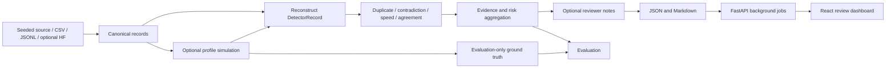

# Architecture

## Data contracts

One canonical record represents one item, aspect and annotator rating. Ratings are
integers 1-5 and completion times are finite and positive. Simulation requires one
source per item/aspect and assigns distinct annotators. The 50-worker default uses
largest-remainder profile allocation: 35 diligent, four rushers, four copy-pasters,
four random clickers and three biased workers. All randomness uses a seeded NumPy
generator. Reruns in the same dependency environment produce byte-identical data.

`AnnotationRecord.for_detection()` reconstructs an exact `DetectorRecord`. Every
detector rejects annotated subclasses, so ground truth cannot accidentally become
a feature. Reports expose the public projection. Only evaluation accesses labels.
Evaluation requires exactly matching unique IDs and complete ground truth.

## Detectors and scores

- Duplicate: TF-IDF unigram/bigram cosine radius neighbors, within the same worker
  across different items. Optional MiniLM embeddings are loaded only when selected.
- Contradiction: lexicon polarity versus rating direction; punctuation and contrast
  reset negation. Neutral ratings do not have a directional hypothesis. Optional
  NLI uses the model's contradiction probability and rating-derived hypotheses.
- Speed: global and within-worker z-scores of log(time / response word count).
  Constant and undersized groups are handled without NaN results.
- Agreement: leave-one-out median of at least two distinct peers on the same item
  and aspect. Ordinal Krippendorff alpha uses per-item rating counts and can be null
  when variation or overlap is insufficient.

Record risk is `1 - product(1 - finding.score)`. Worker risk is mean record risk.
These are ranking scores, not calibrated probabilities or determinations of misconduct.
Most baseline detectors emit binary severity, so risk-threshold sweeps may be identical.

## Services

The API uses a single-process, in-memory store with at most 100 audits and two
active jobs. Uploads are limited to 2 MiB / 2,000 rows; no supplied filename is used
as a filesystem path. States are queued, running, completed and failed. Completed
jobs can be deleted. Restarting clears job history. Export JSON/Markdown to retain
results. The CLI writes durable artifacts independently of the API.

The Vite development server proxies `/api` to port 8000. Compose runs FastAPI and
an Nginx dashboard on localhost; the API image can also serve the built dashboard.
The API container runs as a non-root numeric user. No auth, multi-worker persistence,
distributed scheduling or public deployment protection is claimed in this local v1.

## Optional integrations

Hugging Face streaming is behind the `datasets` extra and normalized from a small
nested fixture. Source timings are explicitly placeholders before simulation.
Sentence Transformers backends are lazy optional imports. Installation and first
real use of those integrations need network/model caches. Unit tests mock downloads
and model loading. OpenAI/Anthropic SDKs use bounded tokens, two retries and 20-second
timeouts. Missing keys fall back to mock; default runs select mock explicitly.
Paraphrase caching is process-local and keyed by provider and input text.

## Scope and limitations

The source generator is a controlled, small template corpus. It is useful for
reproducible demonstrations and software regression tests, not evidence of real-world
annotation accuracy. Repeated templates can trigger duplicate flags; noisy peer
consensus can penalize good annotators. Profile labels store one primary corruption,
even when multiple detectors find related symptoms. Live provider/model compatibility
is unverified beyond mocked contracts. Reviewers must inspect evidence before acting.
